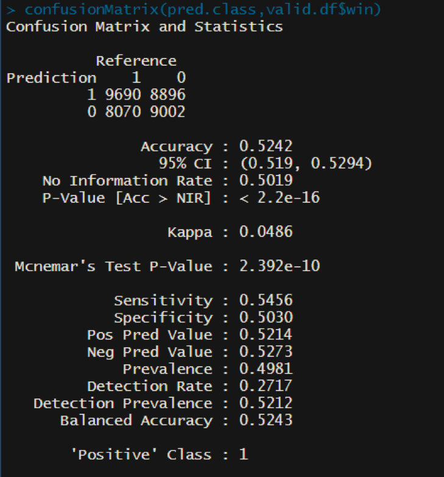
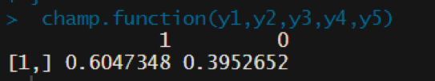
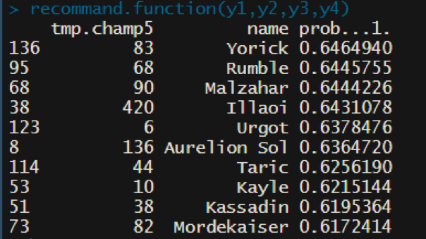

# AI_X tech blog
***

# Project Title : naïve bayes classifier를 이용하여 게임 ‘리그 오브 레전드’의 아군 챔피언(캐릭터) 선택에 따른 챔피언 추천 

***

## Video URL
[video](https://youtu.be/gA7Tu_vCOXo)

***

## Members & Role
* 박철우, 정보시스템학과, tthoutan@gmail.com / 데이터 수집 및 처리, 블로그 작성
* 이윤지, 수학과, yoonji811@gmail.com / 동영상 촬영
* 이동한, 수학과, mgo8246@gmail.com / 데이터 분석 및 결론
* 이제환, 수학과, brptc14@gmail.com / 데이터 분석 및 결론

***

## Table of Contents
* [1.Introduction](#chapter-1)
* [2.DataSets](#chapter-2)
* [3.Methodology](#chapter-3)
* [4.Evaluate & Analysis](#chapter-4)
* [5.Related Work](#chapter-5)
* [6.Conclusion](#chapter-6)

***

<a id="chapter-1"></a>
### 1.Introduction
‘리그 오브 레전드’는 미국의 라이엇 게임즈가 개발 및 서비스 중인 MOBA(Multiplayer Online Battle Arena)장르의 게임으로, 현재 전세계적으로 가장 인기 있는 PC 온라인 게임 중 하나이다. ‘리그 오브 레전드’ 에서는 비슷한 점수대의 유저들이 선호 포지션에 따른 Random으로 선택된 10명의 유저들이 5vs5로 대전하는 게임이며, 각각의 유저들은 게임에서 사용할 챔피언(캐릭터)를 선택한다. 선택할 수 있는 챔피언은 총 145개가 존재하며 각각의 챔피언은 모두 서로 다른 능력치와 스킬을 가지기 때문에 어떤 챔피언을 고르는 지에 따라 게임의 승패에 큰 영향을 미치게 된다. 또한 챔피언들은 같은 팀으로 선택되었을 때 서로가 가진 특징에 따라 상승효과를 불러 일으키는 경우가 많기 때문에 챔피언을 고를 때에는 아군 혹은 적군이 어떤 챔피언을 고르는지도 챔피언 선택의 중요한 근거가 될 수 있다. 우리는 naïve bayes classifier를 이용하여 다른 아군 4명이 챔피언을 골랐을 때 어떤 챔피언을 고르는 것이 승률이 높을 것인지를 근거로 선택할 챔피언을 추천하고자 한다.

***
<a id="chapter-2"></a>
### 2.DataSets
‘리그 오브 레전드’에서는 자체 API를 통해 게임 플레이 데이터를 제공하고 있다. https://developer.riotgames.com/ 사이트를 통해 API 사용 신청하여 승인을 받았고, 이를 통해 naïve bayes classifier (혹은 다른 알고리즘)를 수행하는 데 충분한 데이터를 얻을 수 있다.

데이터 수집 방법 : ‘리그 오브 레전드’에서는 자체 API를 통해 게임 플레이 데이터를 제공하고 있다. https://developer.riotgames.com/ 사이트를 통해 API 사용 신청하여 승인을 받았고, 이를 통해 naïve bayes classifier (혹은 다른 알고리즘)를 수행하는 데 충분한 데이터를 얻을 수 있다.

데이터를 수집하는 자세한 방법에 대해서 설명하겠다.

1) 먼저 데이터 수집을 원하는 기간에 해당하는 게임의 데이터를 수집하기 위해 각 게임의 gameId를 수집할 필요가 있다.
다음의 파이썬 스크립트는 SOLO RANK SILVER 티어에서의 4개의 각 DIVISON에 대해 9.23 패치가 적용되고 나서부터의 gameId를 RIOT API로 받아와서 라이엇에서 자체적으로 분류한 page 단위에 따라 csv 파일로 저장하는 스크립트이다.


```python
# https://github.com/tthoutan/AI_X/get_matchlist.py

import time
import requests
import pandas as pd

header = {"X-Riot-Token":"Your API Token Key"} # Riot Developers Page에서 Development API Key를 발급 받을 수 있다.
default_url = "https://kr.api.riotgames.com"
QUEUE = "RANKED_SOLO_5x5"
TIER = "SILVER"
DIVISON_LIST = ["I","II","III","IV"]
start_time = "1574203380000" # 11월 20일 오전 07:43 pre_season 9.23 패치 적용 후 점검완료 시간

# 각 Player의 Match List를 조회하기 위해서는, SummonerId가 아닌 AccountId가 필요한데, SummonerId를 통해 AccountId를 알 수 있다.
# 그리고 이 get_aid 함수는 summoner_id를 인자로 받아 AccountId를 return 해주는 함수이다.

def get_aid(summoner_id):
    
    path = "/lol/summoner/v4/summoners/"

    total_url = default_url + path + summoner_id

    response = requests.get(total_url, headers=header)

    while response.status_code == 429:
    	print("aid sleep")
    	time.sleep(5)
    	response = requests.get(total_url, headers=header)
    
    return response.json()['accountId']


# queue_type(여기서는 RANKED_SOLO_5x5)과 tier(여기서는 SILVER), division(각 티어마다 I,II,III,IV가 존재함), page number를 인자로 받는다.
# 주어진 인자의 조건에 알맞는 Player 들의 정보를 조회하는 API를 이용해 정보를 조회한 뒤, 그곳에서 SummonerId 값을 뽑아 get_aid 함수를 호출해
# 최종적으로 Player 들의 AccountId로 이루어진 List를 만들어서 반환한다.

def get_summoner_list(queue_type, tier, division, page_number):

	path = f"/lol/league/v4/entries/{queue_type}/{tier}/{division}/?page={page_number}"

	summoner_aid_list = list()

	total_url = default_url + path

	response = requests.get(total_url, headers=header)

	while response.status_code == 429:
		print("summoner sleep")
		time.sleep(5)
		response = requests.get(total_url, headers=header)

	response_list = response.json()

	if len(response_list) == 0:
		return None

	for a in response_list:
		summoner_aid_list.append(get_aid(a['summonerId']))

	return summoner_aid_list


# get_summoner_list 함수 호출을 통해 반환받은 AccountId List를 이용해 각 Player의 Match List를 조회하고 각 Match의 gameId를 뽑아 List를 만든다. 그 뒤 각 page number 마다의 List를 csv 파일로 저장한다.

def get_match_list():

	path = "/lol/match/v4/matchlists/by-account/"

	match_list = list()

	for division in DIVISON_LIST:
		page_num = 1
		while True:
			print(page_num)
			aid_list = get_summoner_list(QUEUE, TIER, division, page_num)
			print("get_summoner_list pass")
			if aid_list is None:
				break

			for aid in aid_list:
				begin_idx = 0
				print(begin_idx)
				while True:
					total_url = default_url + path + aid + "?beginTime=" + start_time + "&beginIndex=" + str(begin_idx)

					response = requests.get(total_url, headers=header)

					while response.status_code == 429:
						print("match list sleep")
						time.sleep(5)
						response = requests.get(total_url, headers=header)

					response_list = response.json()
					matches = response_list.get('matches', list())

					if len(matches) == 0:
						break

					for match in matches:
						match_list.append(match['gameId'])

					begin_idx = response_list['endIndex']

			

			match_list = list(set(match_list))
			
			# 만들어진 해당 페이지의 gameId 리스트를 csv로 export 하는 부분.
			data = pd.DataFrame(match_list)
			data.columns = ['gameId']
			data.to_csv(f'{TIER}_{division}_{page_num}_gameId.csv')

			# page의 수가 너무 많아서 적당한 수준의 데이터의 양을 각 디비전마다 가져오기 위해 page의 개수를 20개로 제한했다.
			page_num+=1
			if page_num > 20:
				break
			match_list=list()
```

2) 다음으로는 각 Player들의 gameId를 수집한 것이고 '리그 오브 레전드'는 5vs5 팀게임이기 때문에, 수집된 gameId의 리스트에 중복되는 값이 많이 있을 가능성이 
존재한다. 따라서 위의 첫번째 스크립트를 통해 만들어진 csv 파일을 통합한뒤 중복된 gameId를 제거한다.

```python
# https://github.com/tthoutan/AI_X/remove_redundant_gameId.py

import csv
import pandas as pd

DIVISION_LIST = ["I","II","III","IV"]

gameId_list = list()

for division in DIVISION_LIST:
	
	page_num = 1

	while True:

		try:
			# read할 csv 파일의 이름 형식은 첫번째 파이썬 스크립트 파일을 참조하라.
			file_name = f"SILVER_{division}_{page_num}_gameId.csv"
			fi = open(file_name, 'r', encoding='utf-8')
			fi_reader = csv.reader(fi)
		
		# 해당 파일이 존재하지 않아 예외가 발생할 경우 while 문을 종료시키고 DIVISON_LIST의 다음 division으로 넘어간다.
		except FileNotFoundError:
			break

		temp_list = list()

		for line in fi_reader:
			temp_list.append(line[1])

		fi.close()

		gameId_list.extend(temp_list)

		page_num+=1

# set의 속성을 이용해 중복된 데이터를 제거한다.
gameId_list = list(set(gameId_list))
print(len(gameId_list))

data = pd.DataFrame(gameId_list)
data.columns = ['gameId']
# 중복제거 및 하나의 리스트로 통합된 모든 게임아이디를 csv파일로 export 한다.
data.to_csv(f'All_gameId.csv')

```

3) 그 뒤 중복제거된 gameId의 리스트를 이용해 실제로 데이터분석에 사용될 각 Match의 Player들이 고른 챔피언의 정보와 어떤 팀이 이겼는지에 대한 데이터를 수집하기 위한 파이썬 스크립트를 동작시킨다.

```python
# https://github.com/tthoutan/AI_X/crawl_match_info.py

import requests
import pandas as pd
import csv
import time
import argparse

# Development API Key는 분당 50개의 request로 요청 수의 제한이 있기 때문에, 여러개의 계정으로 동시에 여러 파이썬 프로그램을 돌리기 위해 API Key를 인자
# 로 받도록 했다. 그리고 num은 각 파이썬 프로그램이 동시에 돌기 때문에 통합된 게임아이디 csv 파일을 일정한 개수로 분할한 뒤 번호를 지정해주고 지정된 번호의 csv 
# 파일을 불러오기 위해 사용했다.
# csv 분할은 # https://github.com/tthoutan/AI_X/csv_spliter.py를 이용했다.

ap = argparse.ArgumentParser()
ap.add_argument("-k","--key", required=True, help="You shoud insert Riot API Key")
ap.add_argument("-n","--num", required=True, help="You shoud insert the number of partition")
args = vars(ap.parse_args())

header = {"X-Riot-Token":f"{args['key']}"}
number = args['num']
default_url = "https://kr.api.riotgames.com"


# response['participants'] is 10 length list -> response['participants'][n]['teamId'], response['participants'][n]['championId']
# response['teams'][0]['win'] == Win or Fail, response['teams'][0]['teamId'] == 100 or 200

def get_match_info():
	
	path = "/lol/match/v4/matches/"

	fi = open(f"gameId_split_{number}.csv", 'r', encoding='utf-8')
	fi_reader = csv.reader(fi)

	line_count = 0
	result_list = list()
	file_num = 1
	row_count = 0

	for line in fi_reader:
		if line[1]=='gameId':
			continue
		row_count += 1

		total_url = default_url + path + line[1]
		response = requests.get(total_url, headers=header)
			
		while response.status_code == 429:
			print("info_sleep")
			time.sleep(5)
			response = requests.get(total_url, headers=header)

		response_list = response.json()
		# response_list['gameMode'] == "CLASSIC" 이어야 한다. KeyError가 발생할 수 있기 때문에 get method를 사용했으며, 게임의 종류에 소환사의 협곡만 있는 것이 아니기 때문에 이러한 필터링 과정을 거쳤다.
		a = response_list.get('gameMode')
		if a != "CLASSIC":
			continue
		else:
			win_list = list() # 승리한 팀의 챔피언 조합을 담기 위한 리스트
			fail_list = list() # 패배한 팀의 챔피언 조합을 담기 위한 리스트
			
			# 만일 블루팀이 승리했을 경우 승리 리스트에 블루팀의 챔피언 조합을 저장하고 레드팀의 챔피언 조합을 패배 리스트에 저장한다.
			if response_list['teams'][0]['win'] == 'Win':
				for i in range(0,5):
					win_list.append(response_list['participants'][i]['championId'])
				# 승리한 팀의 win field 값은 1.
				win_list.append(1)
				for i in range(5,10):
					fail_list.append(response_list['participants'][i]['championId'])
				# 패배한 팀의 win field 값은 0으로 한다.
				fail_list.append(0)
			# 그 외, 레드팀이 승리 했을 경우 승리 리스트에 레드팀의 챔피언 조합을 저장하고 블루팀의 챔피언 조합을 패배 리스트에 저장한다.
			else:
				for i in range(0,5):
					fail_list.append(response_list['participants'][i]['championId'])
				fail_list.append(0)
				for i in range(5,10):
					win_list.append(response_list['participants'][i]['championId'])
				
				win_list.append(1)
			
			# 결과 리스트에 승리팀과 패배팀의 조합을 차례대로 추가하고 line count를 2 추가한다.
			result_list.append(win_list)
			result_list.append(fail_list)
			line_count+=2
			
			# 결과 리스트의 저장개수가 2000개가 될때마다 혹은 분할한 csv 파일의 행의(여기서는 30000) 끝에 도달했을 경우 여태까지의 결과 리스트를 csv 파일로 export 한다.
			if line_count == 2000 or row_count==30000:
				print(f"{file_num}th file completed")
				data = pd.DataFrame(result_list)
				data.columns = ['champ1','champ2','champ3','champ4','champ5','win']
				data.to_csv(f'match_info_{file_num}.csv')
				line_count = 0
				file_num+=1

			print(row_count)


if __name__ == "__main__":
	get_match_info()

```

위 1, 2, 3번의 파이썬 스크립트를 작동한 뒤 얻은 데이터의 형태는 아래와 같다.

```

[
	[champ1, champ2, champ3, champ4, champ5, win],
	[33, 81, 134, 82, 64, 1],
	[36, 57, 67, 122, 84, 0],
	[...],
	[...],
	...
]

```


***
<a id="chapter-3"></a>
### 3.Methodology

naïve bayes classifier 소개 : naïve bayes classifier는 조건부 확률에 대한 bayes theorem에 기반한 것으로 조건부 확률 P(C_i│x_1,⋯x_p )를 계산하게 되며 C_i는 해당 레코드가 속하게 되는 클래스,즉 이 문제에서는 승리 혹은 패배가 되며, 범주형 예측 변수인 x_1,⋯x_p는 아군 5명 각각이 선택한 챔피언이 된다.

***
<a id="chapter-4"></a>
### 4.Evaluation & Analysis

1) 먼저 데이터를 읽고 각 변수들을 범주형 변수들로 선언해줍니다.

```r
library(caret)
library(e1071)

#데이터 불러오기

df_match1 <- read.csv("match_info_partition1_8.csv")
df_match2 <- read.csv("match_info_partition1_23.csv")
df_match3 <- read.csv("match_info_partition2_23.csv")
df_match4 <- read.csv("match_info_partition3_23.csv")
df_match5 <- read.csv("match_info_partition4_22.csv")

df_match <- rbind(df_match1[,-1],df_match2[,-1],df_match3[,-1],df_match4[,-1],df_match5[,-1])

df_match$champ1 <-factor(df_match$champ1)
df_match$champ2 <-factor(df_match$champ2)
df_match$champ3 <-factor(df_match$champ3)
df_match$champ4 <-factor(df_match$champ4)
df_match$champ5 <-factor(df_match$champ5) 
df_match$win <- factor(df_match$win)

df_match$champ1 <- relevel(df_match$champ1,ref="1")
df_match$champ2 <- relevel(df_match$champ2,ref="1")
df_match$champ3 <- relevel(df_match$champ3,ref="1")
df_match$champ4 <- relevel(df_match$champ4,ref="1")
df_match$champ5 <- relevel(df_match$champ5,ref="1")
df_match$win <- relevel(df_match$win,ref="1")

summary(df_match$champ1)
levels(df_match$champ1)

```

2) 학습셋과 검증셋을 80:20으로 나누고, e1071 라이브러리를 사용하여 naïve bayes 모델을 만든다. 이후, caret 라이브러리를 사용하여 만든 confusion matrix 함수를 통해, 검증세트에서의 모델의 정확성을 살펴본다.

```r
#train/valid

set.seed(11)

ti <- sample(c(1:dim(df_match)[1]),dim(df_match)[1]*0.8)
train.df <- df_match[ti,]
valid.df <- df_match[-ti,]


win.nb <- naiveBayes(win~.,data=train.df)

pred.pb <- predict(win.nb,newdata = valid.df, type="raw")
pred.class <-predict(win.nb,newdata = valid.df)
confusionMatrix(pred.class,valid.df$win)
```

결과값




확인 결과 정확도는 52.42%가 나왔습니다. 
Fow.kr에서 확인 결과 9.23패치에서 최고승률 챔피언은 질리언으로 53.66%, 최저 승률 챔피언은 유미로 약 39%입니다. 유미가 비정상적으로 낮은 승률을 기록한 걸 감안하면 선택한 챔피언 평균 승률내서 예측한 것과 큰 차이가 없던가 미세하게 더 좋을 것으로 보입니다.
아무래도 선택한 챔피언만 가지고 승리를 예측하기에는 정보가 조금 부족한게 아닐까 생각합니다.

3) 다음으로 실제 사용을 위해 챔피언 5개의 선택된 상황에서 예측 승률을 보여주는함수와 4개가선택된 상황에서 높은 예측 승률을 가진 챔피언을 출력하도록 하는 함수를 만든다.
(1) 먼저 챔피언-코드 정보를 읽고, 예시로 사용하기 위해 임의의 5개 챔피언을 선택한다.

```r
#예시

df.champ <- read.csv("champ_info.csv")
head(df.champ)

y1 <- "Zac"
y2 <- "Yasuo"
y3 <- "Ashe"
y4 <- "Nautilus"
y5 <- "Garen"

#5개 다 정해진 경우

champ.function <- function(x1,x2,x3,x4,x5){
  
  for(i in 1:146){
    
    if(df.champ[i,3]==x1){champ1 <- df.champ[i,2]}
    if(df.champ[i,3]==x2){champ2 <- df.champ[i,2]}
    if(df.champ[i,3]==x3){champ3 <- df.champ[i,2]}
    if(df.champ[i,3]==x4){champ4 <- df.champ[i,2]}
    if(df.champ[i,3]==x5){champ5 <- df.champ[i,2]}
  
  }
  
  temp <- data.frame(champ1,champ2,champ3,champ4,champ5)
  
  for(i in 1:5){
    temp[,i] <- factor(temp[,i])
  }
  prob <- predict(win.nb, newdata = temp,type='raw')
  return(prob)
  
}

 champ.function(y1,y2,y3,y4,y5)
```

결과값





함수와 예시의 출력결과를 보니, 임의로 적당히 시너지가 나게끔 챔피언을 선택하니 꽤 높은 예측 승률이 나온다.

(2) 다음으로 4개 챔피언이 선택되었을 때, 상위 예측승률 순으로10개 챔피언을 출력하도록 함수를 만들고 예시에 적용한다.

```r
#아군 4명이 정해졌을 때 추천

recommand.function <- function(x1,x2,x3,x4){
  
  for(i in 1:146){
    
    if(df.champ[i,3]==x1){champ1 <- df.champ[i,2]}
    if(df.champ[i,3]==x2){champ2 <- df.champ[i,2]}
    if(df.champ[i,3]==x3){champ3 <- df.champ[i,2]}
    if(df.champ[i,3]==x4){champ4 <- df.champ[i,2]}
    
  }
  
  list <- df.champ$key
  list2 <- setdiff(list,champ1)
  list2 <- setdiff(list2,champ2)
  list2 <- setdiff(list2,champ3)
  list2 <- setdiff(list2,champ4)
  
  list3 <- df.champ$name
  list3 <- setdiff(list3,x1)
  list3 <- setdiff(list3,x2)
  list3 <- setdiff(list3,x3)
  list3 <- setdiff(list3,x4)
  
  tmp <- data.frame(champ1=c(1:142),champ2=c(1:142),champ3=c(1:142),champ4=c(1:142),champ5=c(1:142))
  for(i in 1:142){
    tmp$champ1[i] <- champ1
    tmp$champ2[i] <- champ2
    tmp$champ3[i] <- champ3
    tmp$champ4[i] <- champ4
    tmp$champ5[i] <- list2[i]
  }
  for(i in 1:5){
    tmp[,i] <- factor(tmp[,i])
  }
  
  for(i in 1:4){
    
  }
  
  
  prob <- predict(win.nb,newdata = tmp,type='raw')
  tmp2 <- data.frame(tmp$champ5,name=list3,prob[,1])
  tmp2 <- tmp2[c(order(-tmp2$prob)),]
  return(head(tmp2,10))
  
}

recommand.function(y1,y2,y3,y4)
```


결과값




참고로 예시에서 사용된 가렌의 경우 약 25번째의 순위이며, 상위 승률 챔피언들은 상당수가 탑 포지션의 챔피언과 일부 미드 포지션챔피언으로 구성되어있다. 이는 대다수의 챔피언들이 특정 포지션에서 선택되기 때문에 선택한 챔피언 정보에는 선택한 포지션에 대한 정보도 내재되어 있음을 알 수 있다.

4. 추가적으로 로지스틱 회귀를 통한 승률 예측을 시도해 보았다. 데이터가 너무 커서, 10%의 데이터만 랜덤 추출하여 돌려 보았더니 정확도가 49.69% 정도이다. 로지스틱 회귀는 우리가 흔히 아는 다중 선형회귀와 유사한데, 종속 변수가 번주형 변수인 경우라고 생각하면 이해하기가 편하다. 사용한 로지스틱 회귀 모형은 변수들 간 독립임을 가정하기 때문에, 변수들 간의 상호작용(interaction)을 고려하지 않는다. 따라서 챔피언 간에 시너지가 존재하는 이 프로젝트의 데이터 및 취지와 맞지 않다. 하지만 프로젝트의 본 모델인 naïve bayes를 이용한 모델이 상대적으로 우수하다는 점을 알 수 있다.

```r
#번외 로지스틱 회귀(안돌아가서 데이터 10%만쓴걸로 다시)

lm.fit <- glm(win~.,data=train.df,family = binomial)
lm.fit
pred.lm <- predict(lm.fit,newdata=valid.df)
confusionMatrix(pred.lm,valid.df$win)


new<- sample(c(1:dim(df_match)[1]),dim(df_match)[1]*0.1)
new.df <- df_match[new,]

nt <- sample(c(1:dim(new.df)[1]),dim(new.df)[1]*0.8)
nt.df <- new.df[nt,]
nv.df <- new.df[-nt,]


lm.fit2 <- glm(win~.,data=nt.df,family = binomial)
lm.fit2
head(nv.df)
pred.lm2 <- predict(lm.fit2,newdata=nv.df,type="response")
pred.lm2 <- factor(ifelse(pred.lm2>0.5,1,0))
confusionMatrix(pred.lm2,nv.df$win)
head(pred.lm2)
```


***
<a id="chapter-5"></a>
### 5.Related Work

'리그 오브 레전드'는 전세계적으로 유명하고 굉장히 인기 있는 게임이기 때문에, 위와 같은 생각을 한 유저들이 우리들 뿐만이 아니었다.
Riot에서는 API를 통해 쉽게 데이터셋을 수집 할 수 있도록 해 놓았기 때문에 우리와 비슷한 생각을 가지고 작업한 유저들의 포스팅을 여기저기서 찾을 수 있었다.

1) [League of Legends: Predicting Wins In Champion Select With Machine Learning](https://hackernoon.com/league-of-legends-predicting-wins-in-champion-select-with-machine-learning-6496523a7ea7)
: Neural Network를 포함하여 SVM, random forest 등의 고전 머신러닝 기법을 활용 했다. 하지만 데이터의 수가 1400개 정도로 적고 각각의 챔피언에 대해 one-hot으로 했는지 embedding을 했는지 정확히 표기하지 않았다. 챔피언의 조합만으로 솔로 랭크 게임의 승률을 최대 60%가량의 정확도로 예측했다.

2) [Deep LoL](https://ckcks12.com/dev-reviews/deep-lol-review/)
: 이 포스트에서는 데이터를 취합하는 방법부터 시작해, 모델의 입력을 결정하고 CNN을 통해 추천 챔피언을 뽑아주는 것 까지 한다. 야스오와의 조합으로 말파이트, 자크. 알리스타를 추천하는 것을 포스팅에서 볼 수 있다.

3) [champ2vec](https://queez0405.github.io/lol-project/)
: 해당 포스트에서는 챔피언의 이름을 인풋으로, 단어와 단어간의 관련정도를 통해 승률을 예측했다. NLP(자연어 처리)의 word2vec을 이용해 champ2vec을 구성하고 챔피언 단어 간의 상관관계의 유의미한 정보를 추출했다.

***
<a id="chapter-6"></a>
### 6. Conclusion

선택한 챔피언의 평균 승률만을 통해 예측한 것과 유사한 로지스틱 모델의 정확도는 49.69%, 선택한 챔피언의 상호 작용까지 고려 되는 naïve bayes모델의 정확도는 52.42%로 로지스틱 회귀 모델보다 약간 더 좋다. 물론 정확도 차이의 원인이 로지스틱 회귀 모델에서 사용된 데이터가 더 적기 때문일 수도 있다. 하지만, 전체 데이터의 10%도 약 1만 8천여개의 데이터로 충분한 양의 데이터이며 모델의 원리를 고려해 보면 정확도의 차이는 데이터의 양이 아닌, 변수간 상호작용을 고려한 결과로 보여진다.
그럼에도 불구하고 52.42%의 정확도는 크게 좋아 보이지 않는 것이 사실이다. 선택한 챔피언의 정보 이외에 다른 세부요소(주로 player에 관한 정보)들을 고려하지 않고, 선택한 챔피언만을 이용해 승패를 예측하기에는 정보가 부족한 것으로 보인다. 또한 이 문제에 대해 더 적합한 방법론이 존재할 수 있는데, 여건상 더 다양한 방법을 사용해 보지 못한 부분에서 프로젝트의 한계점이 나타나며, 이를 보완하여 추가적으로 연구하면 더 뛰어난 성과를 얻을 수 있을 것으로 여긴다.
